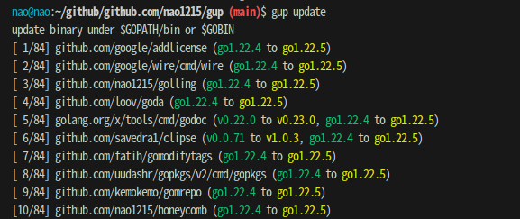

[](https://github.com/nao1215/gup/actions/workflows/build.yml)
[](https://github.com/nao1215/gup/actions/workflows/unit_test.yml)
[](https://github.com/nao1215/gup/actions/workflows/reviewdog.yml)
  
# gupとは  
  
  
**gup**コマンドは、"go install"でインストールしたバイナリを最新版にアップデートします。gupは、すべてのバイナリを並列にアップデートするので、非常に高速です。\$GOPATH/bin (\$GOBIN) 以下にあるバイナリを操作するためのサブコマンドも提供しています。クロスプラットホームソフトであり、Windows, Mac, Linux で動作します。日本語版のみ、[Zenn](https://zenn.dev/nao1215/articles/aef3fe318848d6)に補足記事があります。
  
oh-my-zshを使っている場合は、`gup`はエイリアス設定されています。エイリアスは、 `gup - git pull --rebase`です。gupの実行時は、oh-my-zshのエイリアスを使わないでください（例： $ \gup update）



gupコマンドはアップデートが終わった後、成功したか失敗したかをデスクトップ通知します。  


# インストール方法
### "go install"を用いた場合
golangの開発環境をシステムにインストールしていない場合、[golang公式サイト](https://go.dev/doc/install)からgolangをインストールしてください。

```
$ go install github.com/nao1215/gup@latest
```

### パッケージもしくはバイナリからインストールする場合
[リリースページ](https://github.com/nao1215/gup/releases) には、.deb、.rpm、.apk形式のパッケージがあります。ただし、gupコマンドは内部的にgoコマンドに依存しているため、gokangのインストールが必要です。

# 使用方法
### 全てのバイナリをアップデート
全てのバイナリをアップデートしたい場合は、`$ gup update`を実行してください。

```
$ gup update
gup:INFO : update binary under $GOPATH/bin or $GOBIN
gup:INFO : [ 1/30] github.com/cheat/cheat/cmd/cheat (Already up-to-date: v0.0.0-20211009161301-12ffa4cb5c87)
gup:INFO : [ 2/30] fyne.io/fyne/v2/cmd/fyne_demo (Already up-to-date: v2.1.3)
gup:INFO : [ 3/30] github.com/nao1215/gal/cmd/gal (v1.0.0 to v1.2.0)
gup:INFO : [ 4/30] github.com/matsuyoshi30/germanium/cmd/germanium (Already up-to-date: v1.2.2)
gup:INFO : [ 5/30] github.com/onsi/ginkgo/ginkgo (Already up-to-date: v1.16.5)
gup:INFO : [ 6/30] github.com/git-chglog/git-chglog/cmd/git-chglog (Already up-to-date: v0.15.1)
   :
   :
```
### 指定バイナリのみアップデート
指定のバイナリのみを更新したい場合、updateサブコマンドに複数のコマンド名をスペース区切りで渡してください。
```
$ gup update subaru gup ubume
gup:INFO : update binary under $GOPATH/bin or $GOBIN
gup:INFO : [1/3] github.com/nao1215/gup (v0.7.0 to v0.7.1)
gup:INFO : [2/3] github.com/nao1215/subaru (Already up-to-date: v1.0.2)
gup:INFO : [3/3] github.com/nao1215/ubume/cmd/ubume (Already up-to-date: v1.4.1)
```
### $GOPATH/bin以下にあるバイナリ情報の一覧出力
listサブコマンドは、$GOPATH/bin（もしくは$GOBIN）以下にあるバイナリの情報を表示します。表示内容は、コマンド名、パッケージパス、コマンドバージョンです。


### 指定バイナリを削除
\$GOPATH/bin (\$GOBIN) 以下にあるバイナリを削除する場合は、remove サブコマンドを使用してください。remove サブコマンドは、削除前に削除してよいかどうかを確認します。
```
$ gup remove subaru gal ubume
gup:CHECK: remove /home/nao/.go/bin/subaru? [Y/n] Y
gup:INFO : removed /home/nao/.go/bin/subaru
gup:CHECK: remove /home/nao/.go/bin/gal? [Y/n] n
gup:INFO : cancel removal /home/nao/.go/bin/gal
gup:CHECK: remove /home/nao/.go/bin/ubume? [Y/n] Y
gup:INFO : removed /home/nao/.go/bin/ubume
```

確認無しで削除したい場合は, --forceオプションを使用してください。
```
$ gup remove --force gal
gup:INFO : removed /home/nao/.go/bin/gal
```

### バイナリが最新版かどうかのチェック
バイナリが最新版かどうかを知りたい場合は、checkサブコマンドを使用してください。checkサブコマンドは、バイナリが最新バージョンかどうかをチェックし、アップデートが必要なバイナリ名を表示します。しかし、更新はしません。
```
$ gup check
gup:INFO : check binary under $GOPATH/bin or $GOBIN
gup:INFO : [ 1/33] github.com/cheat/cheat (Already up-to-date: v0.0.0-20211009161301-12ffa4cb5c87)
gup:INFO : [ 2/33] fyne.io/fyne/v2 (current:v2.1.3, latest:v2.1.4)
   :
gup:INFO : [33/33] github.com/nao1215/ubume (Already up-to-date: v1.5.0)

gup:INFO : If you want to update binaries, the following command.
           $ gup update fyne_demo gup mimixbox 
```
  
他のサブコマンドと同様、指定のバイナリのみをチェックする事もできます。
```
$ gup check lazygit mimixbox
gup:INFO : check binary under $GOPATH/bin or $GOBIN
gup:INFO : [1/2] github.com/jesseduffield/lazygit (Already up-to-date: v0.32.2)
gup:INFO : [2/2] github.com/nao1215/mimixbox (current: v0.32.1, latest: v0.33.2)

gup:INFO : If you want to update binaries, the following command.
           $ gup update mimixbox 
```

### エクスポート／インポートサブコマンド
複数のシステム間で、$GOPATH/bin（もしくは$GOBIN）以下にあるバイナリを揃えたい場合、export／importサブコマンドを使ってください。exportサブコマンドは、$HOME/.config/gup/gup.confファイルを生成し、このファイル内にはシステムにインストール済みのコマンド情報が記載されています。  
別のシステム環境に$HOME/.config/gup/gup.confファイルを同じ階層にコピーした後、importサブコマンドを実行してください。gupコマンドは、gup.confの内容に従ってインストールを開始します。
```
※ 環境A (e.g. ubuntu)
$ gup export
gup:INFO: Export /home/nao/.config/gup/gup.conf

※ 環境B (e.g. debian)
$ ls /home/nao/.config/gup/gup.conf
/home/nao/.config/gup/gup.conf
$ gup import
```

### シェル補完ファイルの自動生成 (bash, zsh, fish)
gupコマンドは、bash、zsh、fish向けのシェル補完ファイルを自動生成します。ユーザーがgupを実行した後、シェル補完ファイルがシステムに存在しない場合は、自動生成処理を開始します。シェル補完を有効にするには、シェルを再起動してください。
```
$ gup 
gup:INFO : create bash-completion file: /home/nao/.bash_completion
gup:INFO : create fish-completion file: /home/nao/.config/fish/completions/gup.fish
gup:INFO : create zsh-completion file: /home/nao/.zsh/completion/_gup
```
# 連絡先
開発者に対して「バグ報告」や「機能の追加要望」がある場合は、コメントをください。その際、以下の連絡先を使用してください。
- [GitHub Issue](https://github.com/nao1215/gup/issues)

# ライセンス
gupプロジェクトは、[Apache License 2.0条文](./../../LICENSE)の下でライセンスされています。
